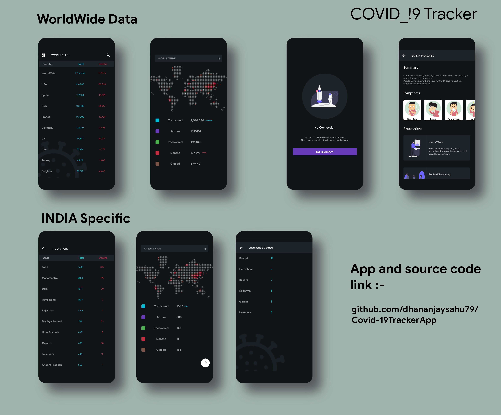

# Covid-19 Tracker

A new Flutter project,that tracks coronavirus data/cases around the world.

It shows worldwide data from rapidapi(requires key)
https://coronavirus-monitor.p.rapidapi.com/coronavirus/worldstat.php

It shows countries data from (requires key)
https://coronavirus-monitor.p.rapidapi.com/coronavirus/cases_by_country.php

It shows India specific details from covid19india.org
https://api.covid19india.org/data.json

If you like it please give it a star :)

